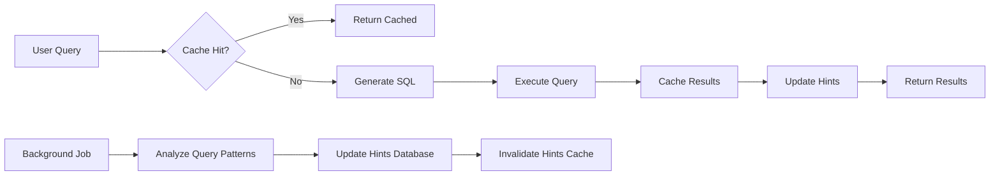

# Database Communication Patterns & Best Practices

## Table of Contents
1. [Connection Patterns](#connection-patterns)
2. [Query Patterns](#query-patterns)
3. [Enum Usage Patterns](#enum-usage-patterns)
4. [Performance Optimization](#performance-optimization)
5. [Common Query Hints](#common-query-hints)
6. [Redis Cache Strategy](#redis-cache-strategy)

---

## Connection Patterns

### MSSQL Connection String Formats

| Pattern | Example | Use Case |
|---------|---------|----------|
| **Standard** | `Server=hostname;Database=dbname;User Id=username;Password=pass;` | Basic connection |
| **With Port** | `Server=hostname,1433;Database=dbname;User Id=username;Password=pass;` | Non-default port |
| **Trusted Connection** | `Server=hostname;Database=dbname;Trusted_Connection=True;` | Windows Authentication |
| **With Encryption** | `Server=hostname;Database=dbname;User Id=username;Password=pass;Encrypt=True;` | Secure connections |
| **Connection Timeout** | `Server=hostname;Database=dbname;User Id=username;Password=pass;Connect Timeout=30;` | Slow networks |
| **Multi-Subnet Failover** | `Server=hostname;Database=dbname;User Id=username;Password=pass;MultiSubnetFailover=True;` | High availability |

---

## Query Patterns

### Essential MSSQL Query Patterns

| Pattern | Natural Language Example | SQL Generated | Notes |
|---------|-------------------------|---------------|-------|
| **Select All** | "Show all records from table" | `SELECT * FROM table WITH (NOLOCK)` | Includes NOLOCK for read performance |
| **Top N** | "Show top 10 customers" | `SELECT TOP 10 * FROM customers` | MSSQL-specific TOP syntax |
| **Filter by Status** | "Show approved applications" | `SELECT * FROM applications WHERE status = 4` | Uses enum translation |
| **Date Range** | "Orders from last month" | `SELECT * FROM orders WHERE order_date >= DATEADD(month, -1, GETDATE())` | MSSQL date functions |
| **Aggregation** | "Count users by role" | `SELECT role, COUNT(*) as count FROM users GROUP BY role` | Group by aggregation |
| **Join Tables** | "Users with their orders" | `SELECT u.*, o.* FROM users u JOIN orders o ON u.id = o.user_id` | Standard join |
| **Pagination** | "Page 2 of results (10 per page)" | `SELECT * FROM table ORDER BY id OFFSET 10 ROWS FETCH NEXT 10 ROWS ONLY` | OFFSET-FETCH pagination |
| **Full-Text Search** | "Search for 'john' in names" | `SELECT * FROM users WHERE CONTAINS(name, 'john')` | Full-text search |
| **NULL Handling** | "Records with no email" | `SELECT * FROM users WHERE email IS NULL` | NULL checking |
| **IN Clause** | "Users from NY, CA, or TX" | `SELECT * FROM users WHERE state IN ('NY', 'CA', 'TX')` | Multiple values |

### Complex Query Patterns

| Pattern | Natural Language | SQL | Use Case |
|---------|-----------------|-----|----------|
| **Subquery** | "Users who placed orders today" | `SELECT * FROM users WHERE id IN (SELECT user_id FROM orders WHERE DATE(order_date) = CAST(GETDATE() AS DATE))` | Filtering with subquery |
| **CTE** | "Hierarchical employee structure" | `WITH EmployeeCTE AS (SELECT * FROM employees WHERE manager_id IS NULL UNION ALL ...) SELECT * FROM EmployeeCTE` | Recursive queries |
| **Window Functions** | "Running total of sales" | `SELECT *, SUM(amount) OVER (ORDER BY date) as running_total FROM sales` | Analytics |
| **PIVOT** | "Sales by month as columns" | `SELECT * FROM sales PIVOT (SUM(amount) FOR month IN ([Jan], [Feb], [Mar])) AS pvt` | Data transformation |
| **Dynamic SQL** | "Variable table name" | `EXEC sp_executesql N'SELECT * FROM ' + @tableName` | Dynamic queries |

---

## Enum Usage Patterns

### Working with Enums in Queries

| Natural Language | Enum Context | Generated SQL | Description |
|-----------------|--------------|---------------|-------------|
| "Approved status" | ApplicationStatus.APPROVED = 4 | `WHERE status = 4` | Direct enum value |
| "Pending or processing" | PaymentStatus.PENDING = 1, PROCESSING = 2 | `WHERE status IN (1, 2)` | Multiple enum values |
| "Not rejected" | ApplicationStatus.REJECTED = 5 | `WHERE status != 5` | Negation |
| "Active users" | UserRole.STUDENT = 1, ADMIN = 2, etc. | `WHERE role_id > 0 AND is_active = 1` | Combined conditions |

### Enum Best Practices

1. **Always use numeric values in SQL** - Enums are translated to numbers
2. **Upload enum JSON files** for each connection to enable natural language understanding
3. **Use descriptive enum names** that match business terminology
4. **Keep enum values consistent** across related tables

---

## Performance Optimization

### Query Optimization Techniques

| Technique | Pattern | Example | Performance Impact |
|-----------|---------|---------|-------------------|
| **NOLOCK Hint** | Read-only queries | `SELECT * FROM table WITH (NOLOCK)` | Reduces blocking |
| **Index Hints** | Force index usage | `SELECT * FROM table WITH (INDEX(idx_name))` | Optimizes specific queries |
| **Query Hints** | Optimize execution | `SELECT * FROM table OPTION (MAXDOP 4)` | Controls parallelism |
| **Temp Tables** | Complex processing | `SELECT * INTO #temp FROM source; SELECT * FROM #temp` | Improves complex query performance |
| **Indexed Views** | Pre-aggregated data | `SELECT * FROM vw_summary WITH (NOEXPAND)` | Fast aggregations |
| **Partition Elimination** | Large tables | `SELECT * FROM orders WHERE order_date >= '2024-01-01'` | Reduces data scanned |

### Connection Pool Settings

| Setting | Recommended Value | Purpose |
|---------|------------------|---------|
| Min Pool Size | 5 | Minimum connections |
| Max Pool Size | 100 | Maximum connections |
| Connection Lifetime | 300 | Seconds before renewal |
| Connection Timeout | 30 | Seconds to wait |
| Packet Size | 8192 | Network packet size |

---

## Common Query Hints

### Searchable Hints Database

| Category | Keywords | Example Query | SQL Pattern | Tags |
|----------|----------|---------------|-------------|------|
| **Filtering** | where, filter, only, with | "Show only active users" | `WHERE is_active = 1` | filter, condition |
| **Sorting** | order, sort, by, ascending, descending | "Sort by date newest first" | `ORDER BY date DESC` | sort, order |
| **Limiting** | top, first, limit, last | "First 5 records" | `SELECT TOP 5 *` | limit, pagination |
| **Aggregation** | count, sum, average, max, min | "Total sales amount" | `SELECT SUM(amount)` | aggregate, calculation |
| **Grouping** | group, by, per, each | "Sales per month" | `GROUP BY MONTH(date)` | group, aggregate |
| **Joining** | with, include, related, associated | "Users with their orders" | `JOIN orders ON` | join, relationship |
| **Date/Time** | today, yesterday, this month, last year | "Orders from today" | `WHERE DATE(order_date) = CAST(GETDATE() AS DATE)` | date, temporal |
| **Comparison** | greater, less, between, equal | "Amount between 100 and 500" | `WHERE amount BETWEEN 100 AND 500` | comparison, range |
| **Pattern Matching** | like, contains, starts with, ends with | "Names starting with 'A'" | `WHERE name LIKE 'A%'` | pattern, search |
| **Null Handling** | empty, null, missing, blank | "Users without email" | `WHERE email IS NULL` | null, missing |
| **Distinct** | unique, distinct, different | "Unique customer names" | `SELECT DISTINCT name` | unique, distinct |
| **Existence** | exists, has, contains | "Customers who have orders" | `WHERE EXISTS (SELECT 1 FROM orders WHERE...)` | existence, subquery |

### Quick Patterns for Frontend Autocomplete

```javascript
// Suggested completions based on user input
const suggestions = {
  "show": ["show all", "show top 10", "show only active", "show latest"],
  "find": ["find by id", "find users where", "find records with"],
  "count": ["count all", "count by status", "count distinct"],
  "get": ["get total", "get average", "get maximum", "get latest"],
  "list": ["list all", "list active", "list by date", "list with details"],
  "search": ["search for", "search in column", "search containing"],
  "filter": ["filter by status", "filter where", "filter active only"],
  "group": ["group by", "group by month", "group by category"],
  "order": ["order by date", "order by name", "order ascending", "order descending"],
  "between": ["between dates", "between values", "between today and"],
};
```

---

## Redis Cache Strategy

### Cache Layers

| Layer | Key Pattern | TTL | Purpose | Update Trigger |
|-------|-------------|-----|---------|----------------|
| **Schema Cache** | `dbairag:schema:{connection_id}` | 1 hour | Database structure | Schema changes |
| **Enum Cache** | `dbairag:enums:{connection_id}` | 2 hours | Enum definitions | Enum file upload/delete |
| **SQL Cache** | `dbairag:sql:{hash(connection_id:prompt)}` | 30 min | Generated SQL | Manual invalidation |
| **Query Result** | `dbairag:query_result:{hash(connection_id:sql)}` | 10 min | Query results | Data changes |
| **Hints Cache** | `dbairag:hints:{category}` | 24 hours | Query suggestions | Hints update |
| **Patterns Cache** | `dbairag:patterns:{type}` | 24 hours | Common patterns | Pattern updates |

### Cache Invalidation Strategy

```python
# Invalidation triggers
triggers = {
    "connection_update": ["schema", "enums", "sql", "query_result"],
    "enum_file_change": ["enums", "sql"],
    "schema_refresh": ["schema", "sql"],
    "hint_update": ["hints"],
    "manual_clear": ["all"]
}
```

### Cache Warming Strategy

1. **On Startup**: Load frequently used patterns and hints
2. **On Connection**: Pre-load schema and enums for active connections
3. **Scheduled**: Refresh popular queries every hour
4. **On-Demand**: Cache as queries are executed

---

## Update Process

### Automated Update Workflow



### Manual Update Process

1. **Update Hints Table**: Add new patterns to database
2. **Invalidate Cache**: Clear hints cache in Redis
3. **Reload Hints**: Trigger hints reload endpoint
4. **Verify**: Check that new hints appear in autocomplete

### API Endpoints for Updates

| Endpoint | Method | Purpose | Cache Impact |
|----------|--------|---------|--------------|
| `/api/hints/reload` | POST | Reload all hints | Clears hints cache |
| `/api/hints/add` | POST | Add new hint | Updates hints cache |
| `/api/hints/update/{id}` | PUT | Update existing hint | Updates hints cache |
| `/api/patterns/sync` | POST | Sync patterns from usage | Updates patterns cache |
| `/api/cache/warm` | POST | Pre-load common queries | Populates cache |

---

## Frontend Integration Guide

### Autocomplete Implementation

```typescript
// TypeScript interface for hints
interface QueryHint {
  id: number;
  category: string;
  keywords: string[];
  example: string;
  sql_pattern: string;
  popularity: number;
  tags: string[];
}

// Fetch hints from backend
async function getHints(category?: string): Promise<QueryHint[]> {
  const response = await fetch(`/api/hints${category ? `?category=${category}` : ''}`);
  return response.json();
}

// Filter hints based on user input
function filterHints(hints: QueryHint[], input: string): QueryHint[] {
  const inputLower = input.toLowerCase();
  return hints.filter(hint => 
    hint.keywords.some(keyword => keyword.includes(inputLower)) ||
    hint.example.toLowerCase().includes(inputLower)
  );
}
```

### Real-time Suggestions

```typescript
// WebSocket connection for real-time updates
const ws = new WebSocket('ws://localhost:8000/ws/hints');

ws.onmessage = (event) => {
  const update = JSON.parse(event.data);
  if (update.type === 'hint_added') {
    // Add new hint to local cache
    addHintToCache(update.hint);
  } else if (update.type === 'cache_invalidated') {
    // Refresh hints from server
    refreshHints();
  }
};
```

---

## Best Practices Summary

1. **Always use parameterized queries** to prevent SQL injection
2. **Cache aggressively** but invalidate smartly
3. **Use enums** for all status/type fields
4. **Monitor cache hit rates** and adjust TTLs accordingly
5. **Keep hints updated** based on actual usage patterns
6. **Use NOLOCK** for read-only queries in MSSQL
7. **Implement connection pooling** for better performance
8. **Log slow queries** for optimization opportunities
9. **Use batch operations** when possible
10. **Test with production-like data volumes**

---

## Troubleshooting Guide

| Issue | Symptoms | Solution | Prevention |
|-------|----------|----------|------------|
| **Slow Queries** | High execution time | Add indexes, use hints | Monitor query performance |
| **Cache Misses** | Low hit rate | Adjust TTL, warm cache | Analyze usage patterns |
| **Connection Timeout** | Failed connections | Increase timeout, check network | Use connection pooling |
| **Enum Mismatch** | Wrong values in SQL | Re-upload enum files | Version enum files |
| **Memory Issues** | Redis OOM | Reduce TTL, limit cache size | Monitor memory usage |

---

## Monitoring Metrics

| Metric | Target | Alert Threshold | Action |
|--------|--------|-----------------|--------|
| Cache Hit Rate | >80% | <60% | Review TTL settings |
| Query Response Time | <500ms | >2000ms | Optimize query/index |
| Connection Pool Usage | <70% | >90% | Increase pool size |
| Redis Memory | <75% | >90% | Clear old cache |
| Error Rate | <1% | >5% | Check logs |

---

## Version History

- **v1.0** - Initial patterns documentation
- **v1.1** - Added enum support and Redis caching
- **v1.2** - Enhanced hints system and update process
- **v1.3** - Added monitoring and troubleshooting guides